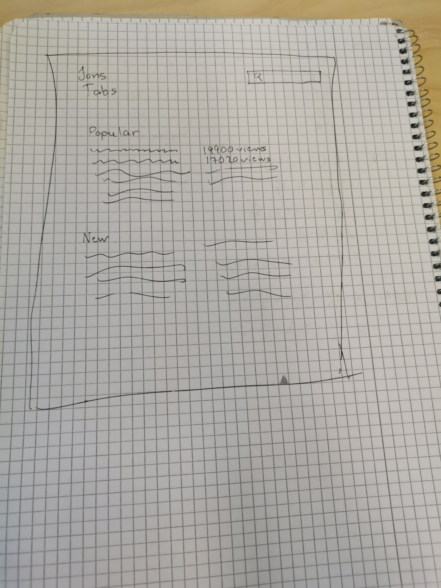

# Projektplan

## 1. Projektbeskrivning (Beskriv vad sidan ska kunna göra)
## En hub för gitarr tabs, olika kategorier, t.ex solos, specifika riffs av en sång. Man kan lägga upp videos av sig själv där man spelar. Man kan lägga reviews på tabsen.
## 2. Vyer (visa bildskisser på dina sidor)

## 3. Databas med ER-diagram (Bild)

## 4. Arkitektur (Beskriv filer och mappar - vad gör/inehåller de?)